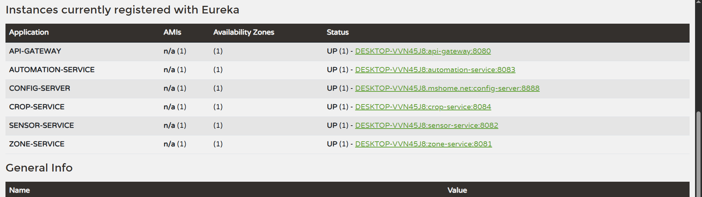

**🌿 Automated Greenhouse Management System (AGMS)**
Microservice-Based Cloud-Native Application

📌 **Overview**

The Automated Greenhouse Management System (AGMS) is a distributed microservices platform designed to modernize agriculture through real-time monitoring and automation.

It collects live environmental telemetry from IoT sensors, processes it using a rule engine, and manages crop lifecycles to optimize greenhouse conditions.

Built using a Spring Boot + Spring Cloud microservices architecture, AGMS ensures scalability, modularity, and fault isolation.

**🛠 Tech Stack**

*         Backend: Java 22, Spring Boot 3.5.11
*         Microservices: Spring Cloud (Eureka, Config Server, API Gateway)
*         Communication: REST APIs, OpenFeign
*         Security: JWT (Gateway-level authentication)
*         Database: MySQL (Polyglot persistence approach)
*         Build Tool: Maven

**🏗 Architecture Overview**

The system is divided into:

1. Infrastructure Services

   | Service          | Port | Description                                           |
   | ---------------- | ---- | ----------------------------------------------------- |
   | Config Server    | 8888 | Centralized configuration using Git-based config repo |
   | Discovery Server | 8761 | Eureka service registry for service discovery         |
   | API Gateway      | 8080 | Entry point for routing & JWT authentication          |

2. Domain Microservices

   | Service            | Port | Description                                            |
   | ------------------ | ---- | ------------------------------------------------------ |
   | Identity Service   | 8085 | User authentication & JWT token generation             |
   | Zone Service       | 8081 | Manages greenhouse zones & temperature thresholds      |
   | Sensor Service     | 8082 | Fetches live IoT telemetry every 10 seconds            |
   | Automation Service | 8083 | Rule engine that triggers actions based on sensor data |
   | Crop Service       | 8084 | Manages crop lifecycle and inventory                   |

   **🚀 Startup Sequence (Important)**

Start services in the following order:

   1. Config Server (8888) – Ensure config repo is available
   2. Discovery Server (8761) – Verify Eureka dashboard is running
   3. API Gateway (8080) – Enables security + routing layer
   4. Domain Services
        Identity Service
        Zone Service
        Sensor Service
        Automation Service
        Crop Service

   **🔐 Security & Integration**
       JWT Authentication: All external requests pass through API Gateway authentication filter.
       Service Protection: Only valid Bearer tokens can access secured endpoints.
       OpenFeign Communication: Used for inter-service communication (e.g., Automation → Zone Service).
       IoT Integration: Sensor Service consumes real-time data from external reactive IoT APIs.

   **📡 API Reference**

   🔑 Identity Service
           POST /auth/register → Register user
           POST /auth/login → Generate JWT token

   📍 Zone Service
           POST /api/v1/zones → Create greenhouse zone
           GET /api/v1/zones → Get all zones

   🌡 Sensor Service
           GET /api/v1/sensors/latest → Get latest telemetry data

   🤖 Automation Service
           GET /api/v1/automation/logs → View triggered actions

   🌿 Crop Service
           POST /api/v1/crops → Add crop batch
           PUT /api/v1/crops/{id}/status → Update crop lifecycle stage

   **📂 Project Structure**

The project follows a clean microservice architecture with separate repositories/modules per service.

Development was organized using feature branches:

        feature/zone-service
        feature/sensor-service
        feature/automation-service
etc.

This ensures:

        Clean commit history
        Modular development
        Easy scalability
        Maintainable architecture

**📸 System Screenshots**

Eureka Dashboard

Displays all services registered and running in UP state.

* 

**✅ Features**

✔ Microservices Architecture ✔ Service Discovery (Eureka) ✔ API Gateway Routing ✔ External IoT Integration ✔ Scheduled Data Fetching ✔ Rule Engine Automation ✔ MongoDB Integration ✔ Crop Lifecycle Management

**👩‍💻 Author**

Sainsa Rethmi Thennakoon Graduate Diploma in Software Engineering – IJSE
